# Pelbu OS — Platform documentation

> Canonical plan for https://github.com/syncbhutan-lang/pelbuOS  
> Saved in-repo under `docs/` (project folder only).

# Pelbu Suites Hotel OS + Public PWA

## Locked decisions

- **Delivery:** Revenue-first phases (public conversion + bookings first), then POS/KOT, then Finance/HR, then channel/scale.
- **Scale:** Multi-property ready from day 1 (one ERP, many hotels/sites/templates). Pelbu Olakha is property #1.
- **Stack:** Next.js (App Router) + TypeScript on **Vercel**; **Supabase** (Auth, Postgres, RLS, Storage, **Realtime**); **Resend** (email); **CallMeBot** (WhatsApp/Telegram alerts); **Cloudinary** (media); PWA (installable, offline shell for staff POS later).
- **Live UI:** Supabase Realtime everywhere ops matter (KOT boards, POS tickets, room status, spa queue, bookings) — no manual refresh.
- **Split work with Claude:** Cursor owns architecture, schema, auth, integrations, ERP modules, reconciliation scripts; Claude owns visual templates, long-form menu/content, marketing copy, and parallel UI polish on isolated branches/files (see work-split below).

## Phase 0 — Agent setup (skills, rules, MCP)

Before feature code:

- Authenticate existing MCPs: Supabase + Vercel (`mcp_auth`).
- Project skills in `.cursor/skills/`:
  - `pelbu-design-system` — anti–AI-slop UI, Bhutanese-modern brand, motion rules, template tokens
  - `pelbu-hotel-ops` — Bhutan check-in/out, SDF, guide/driver beds, agent credit, folio, GST, seasons, KOT/POS
  - `pelbu-claude-handoff` — file ownership map so Cursor/Claude do not collide
- Rules in `.cursor/rules/`: TypeScript/Next conventions, RLS-required DB changes, no hardcoded rates/menus (CMS/ERP only), Realtime for ops screens.
- `AGENTS.md` + `docs/CLAUDE.md` with module ownership and branch naming (`cursor/*`, `claude/*`).

## Architecture

```mermaid
flowchart TB
  subgraph public [Public PWA]
    Site[Template-driven hotel site]
    Book[Rooms Meeting Spa Steam]
    Order[Cafe Pastry Restaurant delivery]
    AgentApp[Agent portal pending approval]
  end
  subgraph erp [ERP Admin PWA]
    CMS[Website CMS]
    FastBook[Fast booking desk calendar grid drawer]
    CheckIn[Checkin Checkout]
    Partners[Guides Drivers master + visit counts]
    Rates[Rate engine]
    Credit[Agent credit ledger]
    POS[POS Cafe Bar Rest Spa]
    KOT[Kitchen KOT]
    Folio[Guest folio]
    Fin[Finance GST Bank recon]
    HR[HR Inventory Audit]
  end
  subgraph data [Supabase]
    DB[(Postgres RLS)]
    RT[Realtime]
    Auth[Auth roles]
  end
  subgraph ext [External]
    Vercel[Vercel]
    Cloudinary[Cloudinary]
    Resend[Resend]
    CallMeBot[CallMeBot]
    Channel[Channel manager Channex]
    OTA[Agoda Booking MMT]
  end
  Site --> DB
  Book --> DB
  Order --> DB
  AgentApp --> Auth
  CMS --> DB
  POS --> RT
  KOT --> RT
  Folio --> DB
  Fin --> DB
  Partners --> DB
  CheckIn --> Partners
  Channel --> DB
  Channel --> OTA
  Resend --> public
  CallMeBot --> erp
  Cloudinary --> CMS
```

**App structure (monorepo-ready):**

- `apps/web` — public multi-tenant sites by domain/subdomain + template id
- `apps/erp` — staff/admin ERP (same Next app with `/erp` route group is OK for v1)
- `packages/db` — Supabase migrations + typed client
- `packages/ui` — design tokens + shared primitives (not generic shadcn lookalikes)
- `packages/rates` — season + guest-tier price resolver
- `scripts/bank-recon/` — Python PDF → table → match engine (BoB, BNB, TBank, DrukPNB)

## Website conversion ambition (design north star)

- The **public website** (not an ops alert system) must be good enough to help drive on the order of **~Nu 40k/day** from cafe + pastry + bar + restaurant + spa/steam + meeting via online discovery, booking, and orders.
- That number guides **UX quality, menus, CTAs, imagery, speed, SEO, and funnel design** — not a mandatory ERP “pace vs 40k” dashboard or CallMeBot nag if behind.
- Normal sales/analytics reports still exist in ERP; they are operational, not a 40k whip.

## Revenue streams (6) + conversion

1. **Rooms** — online booking; rates by season × guest category  
2. **Cafe + Pastry** — summer open 06:30 / winter 07:30; online order + taxi delivery  
3. **Restaurant** — Indian / Bhutanese / multicuisine; breakfast/lunch/dinner menus; TACT (Taste, Aroma, Consistency, Time) + signature items rare in Thimphu  
4. **Bar** — weekend specials menu  
5. **Spa + Steam** — online booking + POS  
6. **Meeting hall** — premium chairs/tables up to 25 pax; online enquiry/book  

Public site: international look, unique templates, analytics funnels per stream, lead capture, WhatsApp/CallMeBot on high-intent guest actions (booking/order confirmations — not revenue-pace alarms).

## Design system — where / how / what

### Where (repo + CMS)

| Location | What lives there |
|----------|------------------|
| `packages/ui` + `templates/pelbu-flagship/` | Layout components, tokens, motion — **code** |
| Supabase `cms_*` tables | All copy, menus, prices, hours, SEO — **editable in ERP** |
| Cloudinary | All photos/food/room/spa images — **generated + uploadable** |
| ERP → Website CMS | Owner edits pages without code; live via Realtime/ISR |

### How (template model)

- Each property has `template_id`.
- **Pelbu Suites Olakha = `template_id: 1` / slug `pelbu-flagship`** — the No.1 reference template (best design, full content, conversion patterns).
- Other hotels/tenants **clone from template_id 1** (or later 2, 3…) then swap branding, photos, menus in CMS — same engine, different look via other template packs.
- Claude may design alternate templates (`heritage-ink`, `alpine-glass`); Cursor owns Pelbu flagship architecture and data wiring.

### What — Pelbu public site sitemap (flagship layout)

Anti–AI-slop: Bhutanese-modern, brand-first hero (logo already in repo), expressive type, atmospheric imagery of the real Olakha building, motion with purpose — not purple gradients / generic Inter dashboards.

1. **Home** — full-bleed building hero + brand + one headline + one CTA (Book / Dine / Spa); below fold: 6 stream cards → deep links  
2. **Rooms** — types, gallery, season rate teaser, book CTA  
3. **Cafe & Pastry** — hours (seasonal open times), menu, order CTA, delivery note  
4. **Restaurant** — Indian / Bhutanese / multicuisine, B/L/D menus, TACT story, reserve table  
5. **Bar** — weekend menu focus  
6. **Spa & Steam** — packages, book slots  
7. **Meeting** — hall up to 25, packages, enquiry/book  
8. **Book** — rooms / spa / meeting (simple paths)  
9. **Order** — cafe/pastry (+ later restaurant delivery)  
10. **Agents** — signup (approval), login, fast book  
11. **About / Contact / Location** — Olakha, Thimphu  

**ERP layout (staff PWA):** dense, fast, mobile-first — Fast book, Arrivals, Check-in, Folio, POS, KOT, Credit, Partners, CMS, Reports.

### Content & media ownership (Pelbu = we create everything)

For **Pelbu Suites only**, the build includes full seed content (not empty CMS):

- All page copy, SEO, CTAs, menus, and imagery crafted so the **website itself** can convert toward ~40k/day F&B+spa+meeting demand  
- Full menus: cafe breakfast/lunch/dinner; restaurant B/L/D; pastry; weekend bar; spa packages; meeting packages — common + **unique Thimphu-scarce** items, TACT notes  
- Generated + curated images (rooms, food, spa, meeting, building) → Cloudinary  
- Hours, policies, GST notes, delivery rules  

Other tenants start by **copying template_id 1**, then replace their own content/images in CMS.

## Rate engine (Bhutan)

Price = `base_rate × season_factor × guest_tier_discount` (or absolute tier rates — store both; prefer absolute negotiated rates for MOU).

**Seasons:** peak | lean | off (date ranges per property, editable in ERP).

**Guest / channel tiers:** walk-in/public | friends | family | mutual_friends | agents | mou_agents.

Rules: only approved agents/MOU see/book their tier; friends/family require staff or owner assignment; public always sees public peak/lean/off.

## Ultra-fast booking (owner / reservation / agents / clients)

Designed for Bhutan reality: most volume is **agents from Bhutan, Jaigaon, and India** — booking must be **simple and fast**, not a 12-step OTA form.

- **One-screen / few-tap booking** on ERP + agent PWA: dates → rooms → pax → agent → guide no → save.
- Who can book: `owner`, `reservation` staff, `agent` / `mou_agent`, direct `client` (public web).
- Defaults from agent profile (rate tier, credit terms, contact); recent guides/drivers autocomplete via master `guides`/`drivers` tables.
- Instant inventory hold with Realtime room board (no refresh).
- Optional: WhatsApp/CallMeBot confirmation to agent + hotel desk.

### Shipped UX (2026-07-29)

- **StayDatesField** shared primitive (`web/src/components/ui/StayDatesField.tsx`): Dates / Nights toggle, persisted per browser via `localStorage`. Default **Nights** on the desk (staff speed), **Dates** on public `/book`. Checkout auto-derived in Nights mode; contract preserved via hidden `check_in`/`check_out` inputs.
- **Three-zone layout** on `/erp/fast-book`: date strip → Excel-like qty grid (guest rooms first, then guide/driver comp; one stepper per row; `unit_count` max hint) → contextual drawer (right rail on desktop, full-width bottom sheet on mobile, auto-opens on first qty > 0).
- **Post-save split:** Desk invoice (no Nu — "Rates applied on save — see folio") + print-friendly Agent voucher with **zero rates** (Tailwind `print:` variants, no `globals.css` edit).
- **Guest origin** field on the drawer drives the guide-required rule (see Check-in below).

## Check-in / check-out (advanced logic, simple UI)

**Goal:** front desk finishes check-in in under ~60–90 seconds when docs are ready; system does the hard validation behind a calm UI.

### Check-in flow
1. Find booking (QR / phone / agent / guide no / room).
2. **Guide number required only for international tourists** (`bookings.guest_origin = 'international'`). Regional / official / local guests (locals, govt officials, domestic) check in without a guide. Owner override still available with audit.
3. Upload / attach **SDF-approved guest documents** (Cloudinary + metadata: name, passport/CID, SDF ref, nationality, validity).
4. Capture **driver details** (name, phone, vehicle no, license) when applicable.
5. **Partner pickers** for guide and driver: native `<select>` of saved master rows, autofills free-text fields, hidden `guide_id`/`driver_id` carries the master link. New partners auto-created on save.
6. Assign **guest rooms** + **guide/driver accommodation** (see inventory below).
7. Open folio; apply agent rate tier; show credit vs cash due.
8. Confirm — Realtime updates housekeeping + room board.

### Guest origin (2026-07-29)

`bookings.guest_origin` drives conditional rules. Values: `international` | `regional` | `official` | `local`. Default `international` for new bookings; existing bookings backfilled to `international`. Shown as a badge next to the stay dates so staff see which rule applies at a glance.

### Check-out flow
1. One-tap **folio review** (rooms + F&B + spa + guest services + comps).
2. Settle: cash / bank / card / **charge to agent credit**.
3. Release rooms + guide/driver beds; print/email GST-aware bill.
4. Mark booking closed; payment posted to agent ledger.

Overrides (late checkout, missing SDF, free upgrade) require role + reason — full audit trail.

## Guide & driver inventory (complimentary beds)

Most guides/drivers stay **in-house free** — treat as first-class inventory, not a note field.

- Room/bed types: `sellable_guest`, `guide_comp`, `driver_comp`, `staff` (optional).
- Booking lines can include N guest rooms + guide bed(s) + driver bed(s) at **rate 0** (comp) or special staff rate.
- Occupancy reports separate **revenue rooms** vs **comp guide/driver beds** so ADR is not distorted.
- Housekeeping sees who is guide/driver vs paying guest.

## Guide & driver partners (repeat partner tracking)

Guides and drivers are repeat partners in Bhutanese hospitality — they bring volume across seasons and deserve recognition. Treated as first-class master entities, not free-text notes.

- **Master tables** `guides` + `drivers` per property: `full_name`, `phone`, `guide_number` (guides) / `vehicle_no` + `license_no` (drivers), `notes`, `visit_count`, `last_seen_at`. RLS enabled (desk-only via service role).
- **Booking links:** `bookings.guide_id` + `bookings.driver_id`. Legacy free-text (`bookings.guide_number`, `booking_drivers` rows) preserved for backward compatibility.
- **Backfilled** from existing `bookings.guide_number` and `booking_drivers` rows; drivers de-duped by phone.
- **Auto-create at check-in:** typing a new guide number or driver name with no master match inserts a new master row; picking from the saved-partner `<select>` autofills fields and carries the master id.
- **`/erp/partners` page:** both lists sorted by `visit_count desc`, search across name/number/phone/vehicle/license, gold visit-count pill, "X days ago" relative last-seen.
- **Deferred (data foundation exists):** `discount_pct` field, POS/spa perk application, folio auto-apply, real-time `visit_count` increment via stored procedure, public-facing partner portal.

## Agent credit + payment history (BT / Jaigaon / India)

- Agents tagged by market: `bhutan` | `jaigaon` | `india` (+ company, license, MoU).
- **Credit account** per agent: limit, used, available, aging (current / 30 / 60 / 90).
- **Payment history** ledger: invoices, receipts, bank refs, write-offs.
- Booking can be `prepaid`, `partial`, or `on_credit` (MOU/agents only within limit).
- Block new credit bookings when over limit (owner override + audit).
- Statements email/WhatsApp; payments match bank recon later.

## Guest folio + GST + concierge buys

- In-house guests charge cafe/bar/restaurant/spa to **room folio** (or master agent folio).
- **Bhutan GST** flag per sellable item / charge type (`gst_applicable`, rate %).
- **Guest services ledger:** taxi, outside shop purchase, errands — line items with vendor, GST or non-GST, markup/fee, attach receipt (Cloudinary), post to folio or cash.
- Folio settlement: cash / bank / card / agent bill-to; GST reports for DRC-ready summaries.

## Auth, signup, demo

- Roles: `guest`, `client`, `agent_pending`, `agent`, `mou_agent`, `reservation`, `staff_*`, `manager`, `owner`, `demo`.
- **Agent signup:** license upload, company details, market (BT/Jaigaon/IN), digital MoU; status `pending` until **phone verification + manual owner approval**.
- **Demo accounts:** time-boxed, watermarked data, cannot mutate live inventory/payments; seed realistic menus/rooms.

## Website CMS + templates

- Entire public content editable from ERP: pages, hero, menus, hours, rooms, spa packages, SEO, CTAs, gallery.
- **`template_id: 1` = Pelbu flagship** (`pelbu-flagship`) — primary product design; tenants clone from it.
- Later templates (`2`, `3`, …) are alternate skins so sister hotels do not look identical.
- Cloudinary for all media; Resend for confirmations; CallMeBot for ops alerts (new booking, KOT delay, agent approval needed).

## UX-first design engineering (business = connect clients)

Priority order on every screen: **1) UX (task success)** → **2) UI structure** → **3) visual polish**. Hotel site exists to connect **clients ↔ hotel** (book, order, enquire, return) — not to look like a Dribbble shot.

### Design tokens (engineered gaps)

- **Grid:** 12-col desktop, 4-col mobile; content max ~1120–1200px  
- **Spacing scale:** 4 / 8 / 12 / 16 / 24 / 32 / 48 / 64 / 96 (no random padding)  
- **Section rhythm:** one job per section; 64–96px vertical between major sections on desktop; 40–56px mobile  
- **Touch:** min 44px targets; sticky primary CTA on mobile for Book / Order  
- **Type:** brand display + one UI sans (not Inter/Roboto default stack); clear H1→body hierarchy  
- **Motion:** 2–3 purposeful motions (hero settle, CTA affordance, page transition) — not noise  
- **Anti-slop:** no purple gradients, no card-soup hero, no pill-stat clutter; brand + one CTA + real Pelbu imagery  

### Public sitemap — section map (every corner)

**Home (conversion hub)**  
1. Nav: logo | Rooms | Dine | Spa | Meeting | Agents | Book (primary)  
2. Hero: full-bleed building, brand, one line, one CTA group (Book stay | Order food | Book spa) — nothing else in first viewport  
3. Six streams strip (Rooms, Cafe/Pastry, Restaurant, Bar, Spa/Steam, Meeting) — equal weight, deep links  
4. Social proof / location (Olakha) — short  
5. Featured menus / today’s pastry — soft upsell  
6. Footer: hours, phone, WhatsApp, map, legal  

**Rooms** — gallery → amenities → season rate hint → Book  
**Cafe & Pastry** — hours (summer 6:30 / winter 7:30) → menu tabs → Order / Delivery  
**Restaurant** — cuisine tabs → B/L/D → Reserve table  
**Bar** — weekend menu hero → Reserve  
**Spa & Steam** — packages → slot picker → Book  
**Meeting** — capacity 25 → package → Enquire/Book  
**Book** — 3-step max: dates → room → confirm (guest) OR agent fast path  
**Order** — cart sticky; taxi delivery note; GST clear on bill  
**Agents** — login / apply (license+MoU) / fast book / credit balance  

### ERP (staff) — UX density, not marketing chrome

Arrivals today | Fast book | Check-in wizard | Room board (guest vs guide/driver) | Folio | POS | KOT | Agent credit | Partners | CMS | Reports  

### Design samples (first deliverable after approval)

Before heavy feature code, produce **visual UX mockups** (desktop + mobile) for:

1. Home  
2. Cafe/Pastry order  
3. Rooms + Book  
4. Agent fast-book  
5. ERP check-in + arrivals  

Saved under `design/mockups/` for review; only then build `templates/pelbu-flagship`.

## Production readiness review (honest)

Benchmarked against **Cloudbeds / Mews / Opera-class HMS**, Bhutan **aBit**, and **Channex** certification practices.

### Verdict

| Scope | Production-ready if we ship phased? |
|-------|-------------------------------------|
| Public conversion PWA + CMS + direct book/order | **Yes** after P1 + QA (Pelbu competitive edge vs Excel) |
| Bhutan ops (fast book, check-in, SDF, guide/driver beds, agent credit) | **Yes** after P2–P3 — this is where custom beats generic Cloudbeds |
| Full POS/KOT/folio/GST | **Yes** after P2 with night audit + voids/comps |
| Bank PDF recon | **Partial→Yes** after sample PDFs + parser QA per bank |
| Channel manager (Agoda/Booking/MMT) | **Not day-one** — needs Channex staging certification (queues, batch ARI, webhooks, full sync) |
| Multi-tenant “rival world ERP” + HR depth | **Not one sprint** — months; schema multi-property-ready from day 1 |

**Bottom line:** The plan can become production-ready **module by module**. It will **not** equal Opera/Mews on day one. It **can** beat Excel + generic OTA websites for Pelbu’s Bhutan agent workflow faster than buying Cloudbeds alone (which won’t natively model guide/driver comps + Jaigaon credit the way you need).

### Gaps to close for real go-live (added to engineering)

- **Payments:** Pay.bt / bank QR / deposit links for agents & guests (Bhutan reality)  
- **Offline / flaky net:** PWA offline shell for front-desk book + check-in queue sync  
- **Overbooking guard:** single inventory source of truth across web + ERP + later Channex  
- **Cancellation / no-show / amendment** policies  
- **Split folio / group master** (tour groups)  
- **Accounting export** (CSV/Tally-friendly)  
- **Staging + UAT checklist** before cutover from Excel  
- **Import** your `2026 boutique 1st season1.xlsx` field map into booking schema  
- **Channex:** event-driven ARI queue, rate limits, reservation ack — not DIY OTA APIs  

### Compared to buying Cloudbeds/aBit

- **Buy:** faster OTA + standard PMS; weaker fit for your guide/driver/SDF/credit Excel world; website often templated.  
- **Build (this plan):** website + Bhutan ops as weapon; OTA via Channex later; higher build cost/time; you own the product for chain templates.

## Ops modules (ERP)

- POS: cafe, pastry, bar, restaurant, spa/steam  
- Kitchen **KOT** realtime board  
- Inventory + recipe/cost (feeds TACT consistency)  
- Room status / housekeeping (guest vs guide/driver)  
- **Partners master (guides + drivers) with visit counts** — `/erp/partners`  
- HR (staff, shifts, leave) — later phase  
- Finance: sales, GST, expenses, **bank reconciliation**  
- Audit log on money/approval actions  
- Reports: occupancy, agent production, F&B/spa sales, stream contribution  

## Bank reconciliation

- Upload statement PDF per bank: **BoB, BNB, TBank, DrukPNB**.
- Python parsers (`scripts/bank-recon/`) → normalized transactions table.
- Auto-match vs payments/folio settlements; manual match UI; exceptions queue.
- Cursor owns parsers; sample PDFs required per bank for accuracy.

## Claude vs Cursor work split

| Cursor (this agent) | Claude |
|---------------------|--------|
| Schema, RLS, auth, Realtime | Template visual systems A/B/C |
| Fast booking + check-in/out engine, SDF/guide/driver | Menu/content writing (TACT + unique items) |
| Rate engine, agent credit ledger, folio, GST | Landing page art direction / motion specs |
| POS/KOT logic, guide/driver bed inventory | Parallel UI pages on `claude/*` branches |
| Bank PDF parsers, Channex | Image prompt packs for Cloudinary shoots |
| Partners master tables + visit counters | Check-in UI polish (visual only) |
| ERP CMS data models | Marketing SEO copy |
| Vercel/Supabase wiring | |

**Handoff rule:** Claude never edits `supabase/migrations`, `packages/rates`, `scripts/bank-recon`, or auth middleware. Cursor never overwrites Claude-owned `templates/*` without merge note.

## Phased delivery

| Phase | Scope | Status (2026-07-29) |
|-------|--------|---------------------|
| **P0** | Skills/rules/MCP + scaffold + UX mockups | **Done** |
| **P1** | Flagship PWA + CMS + F&B/spa/meeting + fast book + guide/driver beds | **Done** |
| **P2** | Check-in/out + POS/KOT + folio + GST + guest services + payments | **Done** |
| **P3** | Agents (BT/Jaigaon/IN) + credit + MoU/demo + rates | **Done** |
| **P4** | Finance + bank recon | **Done** |
| **P5** | HR / inventory / HK / audit / reports | **Done** |
| **P5.5** | Fast-book UX v2 (calendar/grid/drawer + voucher), StayDatesField, guest_origin, partners master | **Done** (2026-07-29) |
| **P6** | Channex certification + extra templates | **Partial** — ARI queue + desk channel UI; staging cert + templates open |
| **P7** | Night audit + voids/comps + deposit links + UAT checklist | **Done** (live Pay.bt/QR provider wiring open) |

**Feature inventory (routes + remaining work):** see [FEATURES.md](FEATURES.md).

## Immediate next steps (post P5.5)

1. Push `main` when ready; finish or stash multi-property switcher WIP.  
2. Run [UAT-CHECKLIST.md](UAT-CHECKLIST.md) before Excel cutover — add cases for guest_origin conditional guide rule, partner auto-create at check-in, fast-book voucher (no rates).  
3. z.ai polish briefs (POS density, agents desk cards) — see `.cursor/plans/ui_arch_compact_592f39c6.plan.md`.  
4. Channex staging: `CHANNEX_API_KEY` + room/rate maps + flush/ack.  
5. Wire live Pay.bt / bank QR webhooks when accounts exist.  
6. Offline desk PWA queue (book + check-in) when net is flaky.  
7. Partner perks: add `discount_pct` to `guides`/`drivers`, surface at POS/spa checkout, auto-apply to folio lines.  
8. Agent voucher PDF generation + Resend send endpoints (UI shell already exists).  
