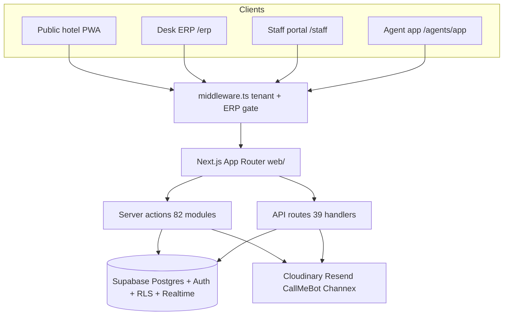
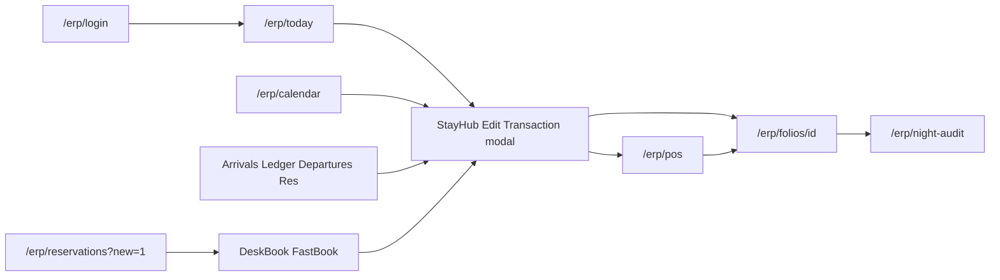

# PelbuOS — Full project audit

**Date:** 2026-09-03  
**Scope:** Modules, menus, screens, routes, flows, APIs, server actions, middleware, frontend surfaces, and backend/schema.  
**Complements:** [FEATURES.md](FEATURES.md) (ship status), [ERP-AUDIT.md](ERP-AUDIT.md) (money-path / security fault register), [PLATFORM.md](PLATFORM.md) (stack intent).

**Counts (repo snapshot):**

| Metric | Count |
|--------|------:|
| App Router `page.tsx` | 164 |
| ERP `page.tsx` under `/erp` | 117 |
| ERP nav modules (`ERP_MODULES`) | 10 |
| ERP nav leaf tabs | 76 |
| API `route.ts` under `/api` | 39 |
| Server action modules (`web/src/app/actions/*.ts`) | 82 |
| Supabase SQL migrations | 179 |
| Tables (approx., migrations) | ~187 |
| Supabase Edge Functions | 0 |

---

## 1. Architecture at a glance

| Layer | Reality |
|-------|---------|
| Frontend | Single Next.js 16 app in [`web/`](../web/) (React 19, Tailwind 4, shadcn) |
| Backend | Server actions + Route Handlers + service-role Supabase — **not** Edge Functions |
| Data | [`supabase/migrations/`](../supabase/migrations/) (~179 files, ~187 tables) |
| Host | Vercel region `sin1` ([`web/vercel.json`](../web/vercel.json)) |
| Docs gap | `packages/db`, `packages/rates` named in [AGENTS.md](../AGENTS.md) — **missing on disk**; rates live in [`web/src/lib/rates.ts`](../web/src/lib/rates.ts) |

---

## 2. Product surfaces (4 apps in one repo)

| Surface | Auth | Entry | Pages (approx) |
|---------|------|-------|----------------:|
| Public conversion PWA | None (guest sealed session for room order) | `/`, `/book`, `/menu`, … | ~30 |
| Desk ERP | Desk PIN cookie **or** staff Supabase + module ACL | `/erp` | 117 |
| Staff portal | employee_code + PIN → `*@staff.pelbusuites.internal` | `/staff` | ~10 |
| Agent app | login_code + PIN → `*@agent.pelbusuites.internal` | `/agents/app` | ~4 |

Workspace picker: `/login` → `/erp/login` · `/staff/login` · `/agents/login`.

---

## 3. ERP navigation — how the menu works

| Layer | Path | Role |
|-------|------|------|
| Module registry | [`web/src/lib/erp-nav.ts`](../web/src/lib/erp-nav.ts) | `ERP_MODULES`, `ERP_QUICK_ACTIONS`, `resolveModule()` |
| Access grants | [`web/src/lib/erp/desk-modules.ts`](../web/src/lib/erp/desk-modules.ts) | Role defaults, `filterErpNavByGrants` |
| FO / BO workspace | [`web/src/lib/erp/desk-workspace.ts`](../web/src/lib/erp/desk-workspace.ts) | Cookie `pelbu_workspace_v1`; FO vs BO module rails |
| Shell | [`web/src/components/erp/DeskShell.tsx`](../web/src/components/erp/DeskShell.tsx) | Sidebar + sticky header + StayHub + mobile nav |
| Sidebar | [`web/src/components/erp/app-sidebar.tsx`](../web/src/components/erp/app-sidebar.tsx) | Icon-collapsible shadcn sidebar |
| Header tabs | [`web/src/components/erp/ModuleHeaderTabs.tsx`](../web/src/components/erp/ModuleHeaderTabs.tsx) | Active module tabs **inline in header** |
| Command palette | [`web/src/components/erp/ErpCommandPalette.tsx`](../web/src/components/erp/ErpCommandPalette.tsx) | Ctrl+K |
| Layout gate | [`web/src/app/erp/layout.tsx`](../web/src/app/erp/layout.tsx) | Auth → DeskShell; skips shell for KDS / print / receipt / slip |

**Workspace split**

- **Front desk** modules: Dashboard, Stay View, Front desk, Rooms, POS + slim “Desk money” (Payments / City Ledger / Night Audit only).
- **FO icon rail:** Today · Stay View · Housekeeping · POS.
- **Back office** modules: Dashboard, Money, Channels, Inventory, Team, POS.
- **Hotel** (Settings, rates, CMS, DOT, Training) stays in sidebar **footer**, not the main rail.

**Tab rails** on each leaf: `daily` | `more` | `hidden` — FO header shows daily; hidden = Ctrl+K / deep link.

---

## 4. ERP modules — screens and menu

Source: `ERP_MODULES` in [`erp-nav.ts`](../web/src/lib/erp-nav.ts).

### Summary

| Module key | Sidebar title | Landing | Nav tabs | ERP pages in domain (incl. deep/print) |
|------------|---------------|---------|---------:|----------------------------------------:|
| `dashboard` | Dashboard | `/erp` | 1 | 1 |
| `calendar` | Stay View | `/erp/calendar` | 2 | 2 |
| `front-desk` | Front desk / Today | `/erp/today` | 10 | ~20 |
| `rooms` | Rooms / Housekeeping | `/erp/rooms` | 6 | ~9 |
| `pos` | POS | `/erp/pos` | 15 | ~22 |
| `money` | Money | `/erp/payments` | 9 | ~25 |
| `channels` | Channels | `/erp/agents` | 9 | ~15 |
| `team` | Team | `/erp/hr` | 10 | ~15 |
| `inventory` | Inventory | `/erp/inventory` | 6 | 6 |
| `hotel` | Hotel (footer) | `/erp/settings` | 8 | ~15 |
| **Total** | | | **76** | **117** pages under `/erp` |

### 4.1 Dashboard (`dashboard`)

| Tab | Route | Rail |
|-----|-------|------|
| Dashboard | `/erp` | more |

Role boards via `?view=` ([`dashboard-views.ts`](../web/src/lib/erp/dashboard-views.ts)). Component: `RoleDashboard`.

### 4.2 Stay View (`calendar`)

| Tab | Route | Rail |
|-----|-------|------|
| Stay View | `/erp/calendar` | daily |
| Day sheet | `/erp/calendar/day-sheet` | more |

Key UI: `RoomRackGrid`, calendar reservation dialogs, live refresh (version poll).

### 4.3 Front desk (`front-desk`)

| Tab | Route | Rail |
|-----|-------|------|
| Today | `/erp/today` | daily |
| Arrival List | `/erp/arrivals` | more |
| Guest Ledger | `/erp/in-house` | more |
| Departure List | `/erp/departures` | more |
| Reservation List | `/erp/reservations` | more |
| Guests | `/erp/guests` | more |
| Sales claims | `/erp/sales-claims` | hidden |
| Rate approvals | `/erp/rate-approvals` | hidden |
| Loyalty | `/erp/loyalty` | hidden |
| Group hotels | `/erp/group` | hidden |

**Deep routes (not nav tabs):** `/erp/check-in`, `/erp/check-out`, `/erp/bookings/[id]`, `/erp/bookings/[id]/settlement-pack`, `/erp/guests/[id]`, `/erp/reservations/print`, `/erp/fast-book` (redirects to `/erp/reservations?new=1`).

**Global modal (no route):** StayHub / “Edit Transaction” — mounted via `StayHubShell` inside DeskShell.

### 4.4 Rooms (`rooms`)

| Tab | Route | Rail |
|-----|-------|------|
| Rooms | `/erp/rooms` | more |
| Floor map | `/erp/rooms/layout` | more |
| Housekeeping | `/erp/housekeeping` | daily |
| Lost & found | `/erp/lost-found` | more |
| Maintenance | `/erp/maintenance` | more |
| Laundry | `/erp/laundry` | more |

**Deep:** `/erp/laundry/qr`, `/erp/laundry/orders/[id]/labels`.

### 4.5 POS (`pos`)

| Tab | Route | Rail |
|-----|-------|------|
| Register | `/erp/pos` | daily |
| Menu | `/erp/menu` | daily |
| Kitchen board | `/erp/kitchen` | daily |
| Day pack | `/erp/kitchen/day-pack` | daily |
| Kitchen TV | `/erp/kds` | daily |
| Print menu | `/erp/menu/print` | more |
| Reservations | `/erp/pos/reservations` | more |
| Recipe cost | `/erp/pos/recipe-cost` | hidden |
| Menu engineering | `/erp/pos/menu-engineering` | hidden |
| Loyalty stamps | `/erp/pos/loyalty` | hidden |
| Outlet rollup | `/erp/kitchen/outlets` | hidden |
| Compliance | `/erp/kitchen/compliance` | hidden |
| Shopping list | `/erp/kitchen/shopping` | hidden |
| Labor / covers | `/erp/kitchen/labor` | hidden |
| Food cost | `/erp/kitchen/food-cost` | hidden |

**Deep:** `/erp/kds/pass`, `/erp/menu/print/[template]`, `/erp/orders/[id]/receipt`, `/erp/orders/[id]/slip`, `/erp/kitchen/food-cost` (also tabulated).

`ModuleHeaderTabs` is suppressed on `/erp/pos` (register owns header).

### 4.6 Money (`money`)

| Tab | Route |
|-----|-------|
| Payments | `/erp/payments` |
| Invoices | `/erp/invoices` |
| City Ledger | `/erp/folios` |
| Night Audit | `/erp/night-audit` |
| Banking | `/erp/finance/banking` |
| Expenses | `/erp/finance/expenses` |
| GST | `/erp/finance/gst` |
| Finance | `/erp/finance` |
| Flash reports | `/erp/reports` |

**Deep / FinanceShell children:** `/erp/folios/[id]` (+ receipt, statement), `/erp/invoices/[id]/print`, `/erp/night-audit/[id]/print`, `/erp/finance/{accounting,bank-proofs,income,vendors,reports,setup}`, `/erp/gst` (legacy), `/erp/reports/[slug]`, `/erp/reports/performance`.

FO workspace trims Money to Payments · Folios · Night Audit only (`FRONT_DESK_MONEY_TAB_HREFS`).

### 4.7 Channels (`channels`)

| Tab | Route |
|-----|-------|
| Agents | `/erp/agents` |
| Confirmed call list | `/erp/agents/confirmed` |
| Agent call tasks | `/erp/agents/call-tasks` |
| Rate downloads | `/erp/agents/rate-downloads` |
| Marketing | `/erp/marketing` |
| Rate plans | `/erp/rate-plans` |
| Partners | `/erp/partners` |
| Allotments | `/erp/allotments` |
| Channel | `/erp/channel` |

**Deep:** `/erp/agents/[id]`, `/erp/agents/[id]/statement`, `/erp/agents/call-tasks/[id]`, CSV export route handlers.

### 4.8 Team (`team`)

| Tab | Route |
|-----|-------|
| Staff | `/erp/hr` |
| Module access | `/erp/hr/access` |
| Positions | `/erp/hr/positions` |
| Vacancies | `/erp/hr/vacancies` |
| Recruitment | `/erp/hr/recruitment` |
| Rota | `/erp/hr/rota` |
| Attendance | `/erp/hr/attendance` |
| Leave | `/erp/hr/leave` |
| ISR / Labour | `/erp/hr/isr` |
| Payroll | `/erp/hr/payroll` |

**Deep:** `/erp/hr/attendance/kiosk`, `/erp/hr/recruitment/print`, `/erp/hr/payroll/[id]`, `/erp/hr/payroll/[id]/payslip/[itemId]`.

### 4.9 Inventory (`inventory`)

| Tab | Route |
|-----|-------|
| Items | `/erp/inventory` |
| Locations | `/erp/inventory/locations` |
| Moves | `/erp/inventory/moves` |
| Assessment | `/erp/inventory/audits` |
| POs | `/erp/inventory/purchase-orders` |
| Assets | `/erp/inventory/assets` |

### 4.10 Hotel (`hotel` — sidebar footer)

| Tab | Route |
|-----|-------|
| Settings | `/erp/settings` |
| Room rates | `/erp/rates` |
| Website CMS | `/erp/front-public` |
| Media | `/erp/front-public/media` |
| Phone upload | `/erp/front-public/media/upload` |
| Add hotel | `/erp/properties/new` |
| DOT assessment | `/erp/dot-assessment` |
| Training | `/erp/training` |

**Deep:** `/erp/front-public/homepage`, `navigation`, `pages/[slug]`, `/erp/properties/[id]/setup`, `/erp/dot-assessment/[id]`, `/erp/dot-assessment/[id]/print`.

---

## 5. Core FO flow (money path)

**StayHub cycle** (components under `web/src/components/erp/stay-hub/`):

Reserve → Confirm → Arrival → Check-in → Stay/Money → Check-out.

Opened from Today, calendar, arrivals / in-house / departures, reservations — not a standalone URL.

**DeskBook / Fast book:** `FastBookDialog` / `DeskBookForm` on `/erp/reservations?new=1`. Same-day confirm can open StayHub Check-in.

**Role landing (typical):** FO → `/erp/today` · kitchen → `/erp/kitchen` · cashier/fnb → `/erp/pos` · owner/gm → `/erp`.

---

## 6. Middleware

File: [`web/src/middleware.ts`](../web/src/middleware.ts)

**Matcher (representative):** `/`, `/book`, `/menu`, `/spa`, `/meeting`, `/erp`, `/erp/:path*`, `/staff/:path*`, `/agents/app/:path*`, `/agents/login`.

| Concern | Behavior |
|---------|----------|
| ERP gate | Non-login `/erp/*` → `/erp/login` unless `pelbu_desk_session` (`ok:${DESK_PIN}`) or Supabase `sb-*-auth-token` cookie |
| Tenant | Sets `x-pelbu-property-id`, `x-pelbu-property-slug`, `x-pelbu-tenant-via` from flagship host or host resolve; **2s deadline**, fail-open |
| Auth refresh | On staff / agents / ERP (without PIN): `@supabase/ssr` `getUser()`; fail-open |
| PWA hint | Mobile install cookie/header on selected public paths |
| **Not in MW** | RLS (Postgres), role/module ACL ([`erp/layout.tsx`](../web/src/app/erp/layout.tsx) + action guards) |

Desk roles (app-layer): `front_desk` | `cashier` | `gm` | `hk` | `owner` | `fnb` | `kitchen` | `laundry`.

---

## 7. Frontend map — public / staff / agents

### Public conversion PWA

| Area | Routes |
|------|--------|
| Home / book | `/`, `/book` |
| Rooms / rates | `/rooms`, `/rooms/[slug]`, `/rates` |
| F&B | `/menu`, `/order`, `/cafe`, `/restaurant`, `/bar`, `/dine` |
| Amenities | `/spa`, `/salon`, `/meeting`, `/laundry`, `/services` |
| Content | `/gallery`, `/faq`, `/contact`, `/careers`, `/guide`, `/guide/[slug]` |
| CMS short links | `/c/[slug]`, `/c/[slug]/print` |
| Pay / loyalty | `/pay/[token]`, `/guest/loyalty` |
| SEO stay hubs | `/stay/olakha-thimphu`, `/stay/hotels-in-thimphu`, `/stay/food-in-thimphu`, `/stay/facilities-service` |
| Agents marketing | `/agents`, `/agents/portal` |
| Login picker | `/login` |

### Staff portal (`/staff`)

`/staff`, `/staff/login`, `/staff/leave`, `/staff/leave/team`, `/staff/payslips`, `/staff/payslips/[id]`, `/staff/notices/[id]`, `/staff/laundry` (+ bags / labels).

### Agent app (`/agents/app`)

`/agents/login`, `/agents/app`, `/agents/app/book`, `/agents/app/calendar` — gated by `getAgentSession()` in layout.

### Non-App-Router assets

[`marketing/`](../marketing/) (print HTML, stickers), [`design/`](../design/) mockups — not routed by Next.

---

## 8. API routes (39 under `/api`)

| Area | Paths |
|------|--------|
| Health | `/api/health` |
| Cron | `/api/cron/expire-holds`, `/api/cron/night-audit` |
| Payments | `/api/payments/webhook` |
| Channel | `/api/channel/channex/webhook` |
| Agents | `/api/agents/rate-card-download` |
| Staff | `/api/staff/attendance/biometric`, `/api/staff/notifications/drain` |
| Laundry | `/api/laundry/sign-upload`, `/api/laundry/stream` |
| Version poll | `/api/erp/{calendar,folio,front-desk,rooms,kot,cot}-version` |
| KOT | `/api/erp/kot-board`, `/api/erp/kot-stream` |
| Ops | `/api/erp/desk-search`, `/api/erp/export`, `/api/erp/night-audit/run`, `/api/erp/night-audit/continuity` |
| Cloudinary | `/api/erp/cloudinary/library`, `/api/erp/cloudinary/sign-upload` |
| HR | `/api/erp/hr/attendance/stream`, `/api/erp/hr/payroll/[id]/export` |
| Finance import | `/api/erp/finance/{batches,upload,preview,export,parsers,…}`, worker `claim` / `callback`, expenses bulk |

**Outside `/api`:** `web/src/app/erp/reservations/export/route.ts`, `web/src/app/erp/agents/confirmed/export/route.ts`.

**Vercel crons** (`web/vercel.json`): expire-holds, staff notifications drain, night-audit.

---

## 9. Server actions (82 modules)

Primary mutation path for ERP. All under [`web/src/app/actions/`](../web/src/app/actions/) (`"use server"`).

| Domain | Files |
|--------|--------|
| Public booking / order / enquiry | `bookings`, `booking-detail`, `orders`, `enquiries`, `service-requests`, `guest-room-order`, `guest-pack`, `stay-hub`, `laundry`, `laundry-bags` |
| Agents (public/portal) | `agents`, `agent-auth`, `agent-book`, `agent-voucher`, `agent-rate-pdf`, `rate-card` |
| Staff portal | `staff-auth`, `staff-portal`, `staff-attendance`, `staff-leave`, `staff-laundry` |
| Desk / calendar / CI | `desk`, `desk-book-preview`, `desk-read-loaders`, `fast-book`, `erp-calendar`, `erp-checkin`, `erp-holds`, `erp-stay-lease`, `erp-ops`, `erp-p9-ops`, `erp-inhouse-tasks` |
| Folio / money / party | `erp-folio-ops`, `erp-folio-damage`, `erp-folio-minibar`, `erp-party-master-bill`, `erp-party-checkin`, `erp-party-docs`, `erp-reservations-party`, `erp-settlement-pack`, `erp-fiscal-docs` |
| Finance / accounting | `erp-finance`, `erp-accounting` |
| Rates / channel / agents desk | `erp-rates`, `erp-rate-plans`, `erp-rate-sheets`, `erp-rate-approvals`, `erp-seasons`, `erp-agreed-rate`, `erp-guest-rate-promo`, `erp-channel`, `erp-agents`, `erp-agent-call-tasks`, `erp-sales-claims`, `erp-partners` |
| POS / kitchen / menu | `erp-pos`, `erp-kitchen`, `erp-fnb-ops`, `erp-menu`, `erp-catalogues` |
| HK / laundry / inventory | `erp-hk`, `erp-laundry`, `erp-inventory` |
| HR / payroll / rota / ISR / DOT | `erp-hr`, `erp-payroll`, `erp-rota`, `erp-isr`, `erp-vacancies`, `erp-compliance`, `erp-dot-assessment` |
| CMS / marketing / properties | `erp-cms`, `erp-cms-media`, `erp-homepage-story`, `erp-mega-menu`, `erp-marketing`, `erp-properties`, `erp-property-media`, `erp-building-layout`, `erp-settings`, `erp-room-map`, `erp-guests`, `erp-loyalty` |

Supporting auth libs (not under `actions/`): `web/src/lib/desk-auth.ts`, `staff-auth.ts`, `agent-auth.ts`, `guest-room-auth.ts`, `finance-import/api-auth.ts`.

---

## 10. Backend / database

### Schema domains (~187 tables)

| Domain | Approx tables | Examples |
|--------|--------------:|----------|
| Property / tenancy / config | ~20 | `properties`, `tenants`, `property_outlets`, `hold_ttl_rules` |
| Rates / rooms | ~12 | `room_types`, `room_units`, `room_rates`, `seasons`, `rate_plans`, `meal_plans` |
| Bookings / FO / rack | ~25 | `bookings`, `booking_rooms`, `room_assignments`, `booking_stay_leases`, `night_audits` |
| Agents / partners | ~10 | `agents`, `agent_credit_ledger`, `agent_allotments`, `agent_call_tasks` |
| Folio / payments | ~5 core | `folios`, `folio_lines`, `payments`, `fiscal_documents`, `payment_links` |
| POS / F&B / kitchen | ~20 | `menu_items`, `orders`, `order_items`, `pos_shifts`, `dining_tables` |
| Laundry | ~11 | `laundry_orders`, `laundry_order_bags`, … |
| Inventory / HK | ~11 | `inventory_*`, `lost_found_items`, `hk_assignments` |
| HR / payroll | ~30 | `staff_members`, `staff_shifts`, `payroll_*`, `hr_*` |
| Finance / accounting / bank | ~30 | `accounting_*`, `bank_*`, `finance_import_*`, `gst_return_packs` |
| Channel | ~4 | `channel_connections`, `ari_queue`, `channel_booking_revisions` |
| CMS / marketing / loyalty | ~22 | `cms_*`, `marketing_*`, `guest_loyalty_*` |
| Ops / compliance | ~8 | `maintenance_orders`, `dot_assessments`, `audit_events` |

Flagship: property slug `pelbu-suites-olakha`, `template_id` 1.

### RLS patterns

| Pattern | Meaning |
|---------|---------|
| Service-role full access | Dominant desk/ERP path; AuthZ in app (`requireMoneyDesk`, `assertDeskProperty`) — residual SEC-01 in [ERP-AUDIT.md](ERP-AUDIT.md) |
| Anon public read | Menus, CMS, public room rates |
| Constrained anon insert | Orders / enquiries intake with fixed status |
| Staff-scoped RLS | Strongest on HR (`private.current_staff_id()` …) |

### Realtime

**Published (~9 tables):** `orders`; HR leave/shift/announcement/attendance; laundry orders/events/bags.

**App consumption:**

- SSE bridge (server listens, clients consume SSE): KOT, laundry, HR attendance streams.
- Version/fingerprint **poll** (no browser Realtime): calendar, folio, rooms, front-desk, KOT/COT versions — by design for Stay View.

### Edge functions

**None** in repo or linked project. Jobs = Next Route Handlers + Vercel crons + Docker finance worker.

### External integrations

| Integration | Wiring |
|-------------|--------|
| Supabase | Auth, Postgres, RLS, Storage, Realtime |
| Cloudinary | Media CDN + sign-upload APIs |
| Resend | Email (vouchers, settlement, fiscal, marketing, NA backup) |
| CallMeBot | WhatsApp ops alerts (`web/src/lib/notify.ts`) |
| Channex | Desk + ARI queue + webhook; **live cert still open** ([CHANNEX-CERT.md](CHANNEX-CERT.md)) |
| Payments | `payment_links` + webhook; Pay.bt / Stripe self-serve open; day-1 bank QR/NEFT |
| Gemini | Receipt OCR in `services/finance-parser-worker/` |
| Facebook Graph | Optional marketing post |

### Operational backends

| Path | Role |
|------|------|
| [`scripts/bank-recon/`](../scripts/bank-recon/) | Python bank PDF parsers → ERP import |
| [`services/finance-parser-worker/`](../services/finance-parser-worker/) | Docker worker ↔ `/api/erp/finance/worker/*` |
| `scripts/import-ezee-*.js`, room assign backfills | Cutover |
| `scripts/uat-smoke.mjs` | QA |

---

## 11. Every ERP page route (117)

**Auth:** `/erp/login`

**FO / stay:** `/erp`, `/erp/today`, `/erp/calendar`, `/erp/calendar/day-sheet`, `/erp/arrivals`, `/erp/departures`, `/erp/in-house`, `/erp/check-in`, `/erp/check-out`, `/erp/reservations`, `/erp/reservations/print`, `/erp/fast-book`, `/erp/bookings/[id]`, `/erp/bookings/[id]/settlement-pack`, `/erp/guests`, `/erp/guests/[id]`, `/erp/sales-claims`, `/erp/rate-approvals`, `/erp/loyalty`, `/erp/group`

**Rooms / HK:** `/erp/rooms`, `/erp/rooms/layout`, `/erp/housekeeping`, `/erp/lost-found`, `/erp/maintenance`, `/erp/laundry`, `/erp/laundry/qr`, `/erp/laundry/orders/[id]/labels`

**POS / kitchen:** `/erp/pos`, `/erp/pos/reservations`, `/erp/pos/recipe-cost`, `/erp/pos/menu-engineering`, `/erp/pos/loyalty`, `/erp/menu`, `/erp/menu/print`, `/erp/menu/print/[template]`, `/erp/kitchen`, `/erp/kitchen/{food-cost,day-pack,outlets,compliance,shopping,labor}`, `/erp/kds`, `/erp/kds/pass`, `/erp/orders/[id]/{receipt,slip}`

**Money:** `/erp/payments`, `/erp/invoices`, `/erp/invoices/[id]/print`, `/erp/folios`, `/erp/folios/[id]`, `/erp/folios/[id]/{receipt,statement}`, `/erp/night-audit`, `/erp/night-audit/[id]/print`, `/erp/finance`, `/erp/finance/{banking,bank-proofs,income,expenses,vendors,gst,accounting,reports,setup}`, `/erp/gst`, `/erp/reports`, `/erp/reports/[slug]`, `/erp/reports/performance`

**Channels:** `/erp/agents`, `/erp/agents/[id]`, `/erp/agents/[id]/statement`, `/erp/agents/confirmed`, `/erp/agents/call-tasks`, `/erp/agents/call-tasks/[id]`, `/erp/agents/rate-downloads`, `/erp/marketing`, `/erp/rate-plans`, `/erp/partners`, `/erp/allotments`, `/erp/channel`

**HR:** `/erp/hr`, `/erp/hr/{access,positions,vacancies,recruitment,recruitment/print,rota,attendance,attendance/kiosk,leave,isr,payroll}`, `/erp/hr/payroll/[id]`, `/erp/hr/payroll/[id]/payslip/[itemId]`

**Inventory:** `/erp/inventory`, `/erp/inventory/{locations,moves,audits,purchase-orders,assets}`

**Hotel / CMS:** `/erp/settings`, `/erp/rates`, `/erp/front-public`, `/erp/front-public/{homepage,media,media/upload,navigation,pages/[slug]}`, `/erp/properties/new`, `/erp/properties/[id]/setup`, `/erp/dot-assessment`, `/erp/dot-assessment/[id]`, `/erp/dot-assessment/[id]/print`, `/erp/training`

---

## 12. Audit findings (gaps / risks)

1. **Docs vs disk:** `packages/db` / `packages/rates` are aspirational; rates + domain logic live under `web/src/lib`. Update AGENTS ownership wording when packages are extracted.
2. **AuthZ model:** Heavy **service-role** desk access; app-layer guards on money paths. Residual SEC notes in [ERP-AUDIT.md](ERP-AUDIT.md) (SEC-01 staff-scoped client rewrite still open).
3. **Channex / payments:** Channel live cert and card PSP self-serve still open per platform docs.
4. **FEATURES.md lag:** Last full sync note **2026-08-10** — IA still matches `erp-nav`; ship-status rows may lag HEAD (e.g. FO polish `d5c3ae3`).
5. **Local git (at audit time):** FO polish commit may sit ahead of `origin/main`; marketing/print WIP often uncommitted — not a runtime gap, but deploy awareness.

---

## 13. Related docs

| Doc | Use |
|-----|-----|
| [FEATURES.md](FEATURES.md) | Feature ship status |
| [ERP-AUDIT.md](ERP-AUDIT.md) | Money-path / security fault register |
| [PLATFORM.md](PLATFORM.md) | Stack, UX north stars, env |
| [CHANNEX-CERT.md](CHANNEX-CERT.md) | Channel go-live checklist |
| [RELEASE-v1.md](RELEASE-v1.md) | v1.0 release package |
| [AGENTS.md](../AGENTS.md) | Agent ownership / model routing |
