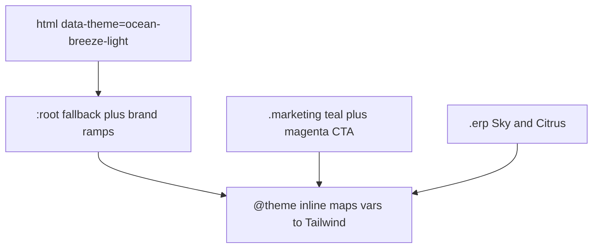

# Hotel OS UI system map

Source of truth is [`web/src/app/globals.css`](../web/src/app/globals.css) (~1000 lines) plus [`web/components.json`](../web/components.json). There is no `tailwind.config`. Tailwind v4 is loaded with `@import "tailwindcss"` and `@tailwindcss/postcss`. Docs in [`PLATFORM.md`](PLATFORM.md) still mention `packages/ui` and `templates/`; those folders are not in the repo. Shipped UI lives under [`web/src/components`](../web/src/components).

## How color actually reaches the screen

Three scopes stack. Later scopes override semantic tokens (`--background`, `--primary`, …). Brand ramps (`--sky-*`, `--citrus-*`, `--gold`, …) stay on `:root` and are available everywhere.

- **Public default.** [`web/src/app/layout.tsx`](../web/src/app/layout.tsx) sets `data-theme="ocean-breeze-light"`. [`web/src/components/providers/theme-provider.tsx`](../web/src/components/providers/theme-provider.tsx) uses `next-themes` with `forcedTheme` locked to the same value. [`web/src/components/theme-switcher.tsx`](../web/src/components/theme-switcher.tsx) exists and is not mounted.
- **Marketing.** Class `.marketing` (layout under the marketing route group) overrides surfaces to a near-white Mews-like page, teal `--primary`, and a magenta `--cta` used only by `.bg-cta`, `.text-cta`, `.border-cta`. Those CTA classes are custom CSS, not Tailwind theme colors.
- **Desk.** Class `.erp` (DeskShell, many pages, and portaled dialogs) replaces semantics with Sky and Citrus: slate paper, ink primary, sky accent `#0ea5e9`, citrus chart amber, radius `0.625rem` (public radius is `0.5rem`). Selector is `.erp:not([data-desk-theme])`. Nothing sets `data-desk-theme`, so every `.erp` node gets this palette. Dialogs and menus that portal outside `.erp` must repeat the class or they fall back to Ocean Breeze.

## Custom CSS vs shadcn tokens

[`web/src/app/globals.css`](../web/src/app/globals.css) sections:

| Lines | What it is |
| --- | --- |
| 1–116 `:root` | Legacy brand anchors (ivory, espresso, maroon, gold, brass, ink, paper) plus Sky / Citrus / Mint / Frost ramps, then Ocean Breeze semantic fallbacks in `oklch`. |
| 118–162 `.dark` | Evening sky-ink palette. Tweakcn dark themes do not use this class. They use `[data-theme="…-dark"]`, which the forced theme never applies. |
| 168–262 `.erp` | Desk token override and mobile table/input rules under 767px. |
| 264–291 | `.desk-premium-empty`, `.desk-premium-enter`, fade-in keyframes. |
| 293–404 `@theme inline` | Registers CSS variables as Tailwind colors, radius, fonts, and animations (`accordion-down/up`, `marquee`, `shimmer-slide`, `spin-around`). This is the bridge from custom CSS to `bg-primary`, `text-citrus`, `font-display`. |
| 406–452 | Magic UI / accordion keyframes and a reduced-motion kill switch. |
| 454–479 `@layer base` | Border color, body font, selection. |
| 485–518 `.marketing` | Hybrid marketing tokens and CTA helpers. |
| 520–568 `@layer components` | `.label-quiet`, `.label-quiet--on-ink`, `.font-display` (Fraunces + `ss01`), `.lede`, `.media-card`. |
| 570–588 `@layer utilities` | `.reveal` / `.reveal.is-visible`, `.ink-panel`. |
| 599–670 | POS fullscreen: `body.pos-fs` hides desk chrome; `.pos-fs-shell`; `.kbd`. |
| 676–799 | `#pelbu-splash` BEM (`.pelbu-splash__stage`, `__mark`, `__ring`, `__word`). |
| 801–999 | Print: `.desk-print-host`, `.catalogue-print`, `.doc-print-sheet`, `.fiscal-invoice-*`. |

No `@utility` blocks. No other CSS files outside this file and the theme pack. PostCSS is only Tailwind.

**`--muted` vs `--muted-shadcn`.** They are different on purpose. `--muted` (`#475569`) is the text color used by `.label-quiet`. `--muted-shadcn` is the shadcn surface. `@theme` maps `--color-muted` to `--muted-shadcn`, so `bg-muted` is a surface. Tweakcn theme files set `--muted` (the shadcn name), not `--muted-shadcn`, so switching `data-theme` would move `--background` / `--primary` and leave `bg-muted` on the desk or `:root` surface token.

## shadcn kit

[`web/components.json`](../web/components.json): style **new-york**, RSC, TSX, `baseColor: neutral`, `cssVariables: true`, icons **lucide**. Aliases: `@/components/ui`, `@/lib/utils`.

`cn()` is [`web/src/lib/utils.ts`](../web/src/lib/utils.ts) (`clsx` + `tailwind-merge`). UI imports that helper, not the `cn` npm package.

**Stock shadcn** (Radix or the usual New York files): accordion, avatar, calendar, chart, checkbox, command, context-menu, dialog, dropdown-menu, hover-card, input, label, navigation-menu, popover, resizable, scroll-area, select, separator, sheet, skeleton, sonner, table, tabs, textarea, tooltip, sidebar, card.

**Customized shadcn:**

- [`web/src/components/ui/button.tsx`](../web/src/components/ui/button.tsx) — `rounded-xl`, sentence-case product buttons. Variants: `default`, `destructive`, `outline`, `secondary`, `ghost`, `link`, plus brand `gold`, `brass`, `citrus`, `mint`. Sizes: `default` (h-10), `sm`, `lg`, `xl`, `icon`. `asChild` via Radix Slot.
- [`web/src/components/ui/badge.tsx`](../web/src/components/ui/badge.tsx) — pill. Variants: `default`, `secondary`, `destructive`, `outline`, plus `gold`, `maroon`, `citrus`, `mint`, `sky`.
- `alert.tsx` — `default`, `info`, `warning`, `success`, `destructive`.

**Hotel widgets that live in `ui/` (not shadcn):** combobox, data-table (TanStack), empty-state, expandable-text, file-dropzone, message-loading, StayDatesField.

**Usage.** `Button` from `@/components/ui/button` is the standard: about 885 `<Button` uses in about 259 files. Raw `<button` is about 202 uses in about 98 files (mostly icon hits, print, or one-off controls). There is no `btn-` class system. Named wrappers (`PrintButton`, `CopyForWhatsAppButton`, and similar) still render `Button`.

## Magic UI and motion (copied, not an npm package)

In `web/src/components/ui/`: shimmer-button, magic-card (`gradient` | `orb`), blur-fade, border-beam, marquee, number-ticker, animated-grid-pattern, dot-pattern. Animations are registered in `@theme inline`. `ShimmerButton` shows up on marketing pricing and auth forms. Framer Motion is a dependency; desk motion also uses `DeskBlurFade` and the `.reveal` utility. Design rule in [`.cursor/skills/pelbu-design-system/SKILL.md`](../.cursor/skills/pelbu-design-system/SKILL.md): two or three purposeful motions, not decoration noise.

## tweakcn theme pack (installed, mostly unused)

[`web/src/styles/themes/index.css`](../web/src/styles/themes/index.css) imports **43** theme files. Each has light and dark, so [`web/src/lib/themes-config.ts`](../web/src/lib/themes-config.ts) lists 86 values. Selector pattern is `[data-theme="ocean-breeze-light"]`, not `.dark`. `default.css` is a stub (background, foreground, primary, radius only). The live public theme is **ocean-breeze-light** only. Theme CSS names fonts (Inter, Poppins, Outfit, …) that `next/font` does not load.

**Fonts that are loaded** in [`web/src/app/layout.tsx`](../web/src/app/layout.tsx): DM Sans (`--font-sans`), Fraunces (`--font-display`), Lora (`--font-serif`), Geist Mono (`--font-mono`).

## Component map (`web/src/components`, ~412 files)

- **`erp/` (~318).** The product. Shells: DeskShell (sidebar + header), DeskListShell, StayHubShell, SettingsShell, FinanceShell, RoomMapShell, AgentAppShell, StaffAppShell, PosLayout, PropertySetupModalShell, CompliancePrintShell. Subfolders: pos, stay-hub, menu/print, finance, settings, cms, inventory, fnb, order-board, building, dot-assessment.
- **`ui/` (45).** Primitives above.
- **`marketing/` (16).** Product site chrome: MarketingChrome, MarketingHeader, MarketingFooter, MarketingMegaNav, MarketingHero, MarketingReveal. Separate from a guest hotel site.
- **`laundry/` (12), `pwa/` (8), `site/` (2), `platform/` (2), `agents/`, `book/`, `pay/`, `rates/`, `analytics/`, `providers/`.** Laundry desk, splash/PWA, PublicSiteHeader, PortalShell, small funnels.

## UI libraries (from `web/package.json`)

Radix primitives (accordion through tooltip, plus umbrella `radix-ui`), `class-variance-authority`, `clsx`, `tailwind-merge`, `tailwindcss` 4, `tw-animate-css`, `lucide-react`, `framer-motion`, `next-themes`, `cmdk`, `sonner`, `recharts`, `embla-carousel-react`, `react-day-picker`, `@tanstack/react-table`, `react-resizable-panels`.

## What to use when editing UI

- Desk screens: wrap with `erp` (including portaled dialogs) and use `Button` / `Badge` semantic or brand variants. Prefer `bg-background`, `text-foreground`, `bg-card` so a future desk theme can swap tokens.
- Marketing CTAs: `.bg-cta` under `.marketing`, not `variant="default"` (that follows teal `--primary`).
- Brand color utilities (`bg-citrus`, `text-gold`, `bg-sky-500`) come from `:root` via `@theme`. They do not change when `data-theme` changes.
- Do not add a second button system or a new global CSS file. Extend `buttonVariants` or a scoped class in `globals.css`.
