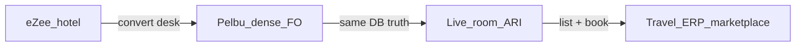

# eZee → Pelbu switch catalogue (Bhutan FO)

**Date:** 2026-08-17  
**Audience:** Sales demos · FO UAT · conversion pitches to hotels on eZee FrontDesk / Absolute  
**Hang-card (print at desk):** [fo-ezee-to-pelbu-hang-card.md](../ops/fo-ezee-to-pelbu-hang-card.md)  
**Deep control dump:** [ezee-screenshot-inventory.md](ezee-screenshot-inventory.md) · [ezee-controls.csv](ezee-controls.csv) · [ezee-absolute-full-map.md](ezee-absolute-full-map.md)  
**Parity ship status:** [ezee-fo-parity-status.md](../plans/ezee-fo-parity-status.md)

---

## 0. North star

Pelbu hotel ERP = **as dense as eZee** (every FO job in reach) **and** usable/advanced (PWA, realtime, StayHub) **and** Bhutan-localized (SDF, Nu, GST/SC, guide/driver, agent room cap) — so eZee properties can switch. Once hotels run Pelbu, **live room inventory** feeds a **travel ERP** (list hotels + sellable allotment).

**Density ≠ clone chrome.** Same *jobs and controls* inside Calendar / DeskBook / StayHub — not Windows wizard shells.

**Conversion order:** (1) Win desk → (2) Win books → (3) Rack never lies → (4) Expose ARI (`/erp/channel` + travel ERP) → (5) Marketplace.

**Do not promise** full ~112 eZee report parity on Day-1. Promise day-1 FO jobs + honest gap list.

---

## 1. Sources

| Source | What it is |
|--------|------------|
| [YouTube pelbusys](https://youtu.be/jtMeH5v-O9w) | ~6m18s guided tour — eZee FrontDesk 7.0 @ **Seven Suites** (user Choki). Unlisted; inventoried 2026-08-17 via 32 frames (~every 12s). |
| [`Eze Screens/`](../../Eze%20Screens/) | 58 screenshots (2026-08-06/11) — same property; deep control + report-tree dump |
| This catalogue | Manager language: flows · folio · reports · Pelbu map · gaps |

Video = short tour. Screenshots = control matrix. Cite both.

---

## 2. Status legend (Pelbu column)

| Status | Meaning |
|--------|---------|
| **Parity** | Job works at desk without apology |
| **Partial** | Job exists; missing eZee density or named print |
| **Board** | Operational board covers the job (not a named “Report”) |
| **Ahead** | Pelbu stronger than eZee for Bhutan boutique |
| **Missing** | Not shipped — list honestly |
| **NA** | Out of Bhutan boutique scope (condo, M-Pesa, …) |
| **Defer** | Explicitly not Day-1 |

---

## 3. Modules & flows (what FO managers live in)

### 3.1 App chrome

| eZee | Pelbu | Status |
|------|-------|--------|
| Property + user | Header property · staff name | Parity |
| Working / Audited / Shift dates | **Biz date** chip · night audit audited day · (no separate Shift Date) | Partial |
| CTRL+SPACE search | **Ctrl+K** | Parity |
| Live Support | Owner WhatsApp / ops docs | Defer (by design) |
| Icon rail FO / BO / Tools / HK | Sidebar + **Front desk \| Back office** chip | Parity (different IA) |
| Night Audit / Undo Night Audit | `/erp/night-audit` · Undo NA Missing | Partial |

### 3.2 Stay View → Calendar

| eZee | Pelbu | Status |
|------|-------|--------|
| Room × date Gantt | `/erp/calendar` | Parity |
| 7 / 15 / 30 day span | Day zoom / range on rack | Partial |
| Vacant / Occ / Reserved / OOO / Due Out / Dirty | Rack + rooms/HK + board counts | Partial |
| Drag / resize / group tint | Drag-select · resize · group tint | Parity |
| Group block multi-room | Party / formal group | Parity |

### 3.3 Front Office nav jobs

| eZee | Pelbu | Status |
|------|-------|--------|
| Walk In (3-step wizard) | Rack create / DeskBook → StayHub CI | Partial (jobs yes; no wizard clone) |
| Reservation wizard + release % | DeskBook + release fields | Partial |
| Reservation List + color legend | `/erp/reservations` | Partial → near Parity |
| New Booking (group 4-step) | Party board · multi-room DeskBook · StayHub multi-room | Partial / Ahead (Check-in all) |
| Booking List (booking#) | Overlaps reservations / party | Partial |
| Out of Order | `/erp/rooms` + calendar OOO | Parity |
| Guest Ledger | `/erp/in-house` + StayHub Folio | Partial |
| Arrival / Departure List | `/erp/arrivals` · `/erp/departures` | Parity / Ahead |
| Guest Database | `/erp/guests` | Partial |
| Guest Message center | StayHub / in-house **tasks** (message kind) · no inbox UI | Partial / Defer center |

### 3.4 Edit Transaction (= StayHub)

eZee tabs: General · Room Sharing · Other · Rate Information · Extra Charges · Payment Details.

| eZee surface | Pelbu | Status |
|--------------|-------|--------|
| General (guest, settle, source, tax exempt, release, remarks, flags, next-res, audit by) | StayHub Details + More | Partial |
| Rate Information per-night grid | StayHub night grid (read-only / edit path) | Partial |
| Extra Charges | Folio Bill · extras | Parity |
| Payment Details | Folio Collect | Parity |
| Room Sharing / visa / pickup / vehicle / KIN | StayHub More · CI · guest list | Partial |
| Other (DNR, prefs, house use) | StayHub More | Partial |
| More: Change Stay, Move, Wakeup, Follow-up, Audit, Assign Guide | StayHub lifecycle + tasks + guide evidence | Partial / Ahead (guide pack) |
| Print voucher / reg / FC | Print pack · Settings Documents · FC Defer | Partial |

### 3.5 Book wizards (fields Bhutan desks use)

Do **not** clone 3-step chrome. Map fields:

| Field cluster | Pelbu | Status |
|---------------|-------|--------|
| Dates · nights · A/C/I | DeskBook | Parity |
| Rate type RACK/EP/CP/MAP/AP/COMP | Meal packages + tiers | Partial |
| Tax exempt Bhutan / Service / GST · incl/excl | Book tax mode/exempt | Partial / Parity (shipped FO-parity) |
| Clean rooms only | Clean unit pick | Parity |
| Business source · commission · rate matrix | Agents + tier/% · matrix UI thin | Partial |
| Overbook column | Guard only | Missing buffer UI |
| Currency calculator Nu | Nu native | Ahead |

### 3.6 Tools

| eZee | Pelbu | Status |
|------|-------|--------|
| Lost & Found | `/erp/lost-found` | Parity |
| Wakeup / Follow-up / Guest message | `inhouse_tasks` + StayHub | Partial |
| Network Lock | Soft multi-tab stay lock | Partial |
| Reminder · Phone Directory · Transport masters | — | Missing / Defer |

---

## 4. Folio · bill · invoice · settlement

eZee staff say **folio / room bill / city ledger**. Pelbu separates **ops confirmation** from **tax invoice**.

### 4.1 Folio account

| Job | eZee | Pelbu | Status |
|-----|------|-------|--------|
| Folio # on stay | Folio No + refresh | Folio id on StayHub / `/erp/folios/[id]` | Partial |
| Manage Folio board | Rate · Ext · Disc · Pay · Adj · Balance | StayHub Folio → **Bill** ledger | Partial |
| Master Folio / group bill-to | Master filter · bill-to owner | Advanced master/split · party collect · statement | Partial |
| Folio for sharer | Flag / generate | Partial multi-guest · weak per-sharer folio | Partial |
| Auto folio routing | More (often disabled) | — | Missing |
| Show voided / close folio | Checkboxes on extras/pay | Void on row · closed folios | Partial |

### 4.2 Charges

| Job | eZee | Pelbu | Status |
|-----|------|-------|--------|
| Room/tax nights | Rate Information tab | Folio room nights + night grid | Partial |
| Extra charges | Extra Charges tab | Bill extras · POS strip | Parity / Ahead (POS) |
| Packages / inclusions | Special Packages | Meal packages | Partial |
| Nightly post | Night Audit | `/erp/night-audit` | Partial |

### 4.3 Payments / settlement

| Job | eZee | Pelbu | Status |
|-----|------|-------|--------|
| Cash / Credit / Partial Credit | Settlement radios | Collect cash · **Charge agent AR** | Partial |
| Bill To | Account picker | Agent bill-to on book + Collect | Partial |
| Amount Paid (Nu + FX) | Dialog · City Ledger tender | Collect Nu · Charge agent AR | Parity / Ahead |
| Encash / Refund / Void | Payment Details | Collect + void | Partial |
| CO needs clear balance | Soft rule | StayHub Checkout → collect first | Parity |

### 4.4 Print / “invoice” documents

| eZee document | Preview | Print | FC | Pelbu | Status |
|---------------|---------|-------|----|-------|--------|
| Master Folio Summary | • | • | • | Group statement `/erp/folios/[id]/statement` | Partial |
| Master Folio Details | • | • | • | Same + Advanced | Partial |
| Folio Summary | • | • | • | Bill print · Settings Invoice/Receipt | Partial |
| Folio Details | • | • | • | Bill ledger + print | Partial |
| Registration Card | • | • | • | Reg print + signed photo upload | Partial / Ahead |
| Settlement Details | | • | | Settlement pack | Partial / Ahead (guide photo) |
| Extra Charge Details | | • | | Bill filter Extra | Partial |
| Voucher Preview/Print/Email | • | • | | Confirm pack · Resend | Partial |
| **Room Bill** (tax lines, amount in words, CID) | report viewer | • | | Folio GST+SC · editable templates | Partial |
| Foreign Currency print | $ submenu | | | — | Defer (Nu desks) |

### 4.5 IDs — do not confuse

| Concept | eZee-ish | Pelbu |
|---------|----------|-------|
| Stay / confirmation | Res # / Confirm # / Web # | **`PS-YYYY-#####`** — ops search only |
| Tax / sales bill | Generate Bill No · Sales Bill | Fiscal **`INV-YYYY-####`** — issued from folio only |
| Receipt | Payment receipt # | RCP from folio collect |
| Agent AR | City Ledger | Charge agent AR · city ledger · agent dossier |

### 4.6 Money reports FO will ask for

See §5.6–5.8 (Direct Billing, Night Audit, Back Office). Closest Pelbu: agent-ar · guest-ar-aging · night-audit pack · finance/GST.

---

## 5. Full report appendix (~112 named)

**Export formats (eZee every report):** RTF · Word · Excel · PDF · HTML · Excel Data Only · Set Default  
**Pelbu today:** CSV + Print on report pages · PDF-ish print packs — Partial (no RTF/Word/HTML/Set Default).

**Param forms captured in corpus:** Arrival List · Booking List · Cancellation · Deposit Due · Monthly Availability · Monthly Room Inventory · Reservation List · Direct Billing Aging.  
**Sample prints:** Reservation List · Yearly Occupancy · Registration Card · Room Bill (video).

Pelbu named catalog (`web/src/lib/reports/catalog.ts` + `/erp/reports/performance` + night-audit): agent-production · agent-ar · deposit-due · cancellations · meal-count · fo-occupancy · room-moves · guest-ar-aging · group-outstanding · group-arrivals · group-in-house · staff-attendance · staff-sales · inventory-movements · performance · manager flash.

### 5.1 Reservation (8)

| # | eZee report | Pelbu | Status |
|---|-------------|-------|--------|
| 1 | Arrival List Report | `/erp/arrivals` + filters | Board / Partial report |
| 2 | Booking List | Party / reservations | Partial |
| 3 | Cancellation Report | `/erp/reports/cancellations` | Partial |
| 4 | Deposit Due Report | `/erp/reports/deposit-due` | Partial |
| 5 | Monthly Availability Chart (R/B/I/S) | Calendar occ | Partial |
| 6 | Monthly Room Inventory | Calendar / rooms | Partial |
| 7 | Reservation List | `/erp/reservations` + CSV/print | Partial |
| 8 | Reservation List (FCC) | — | Missing |

### 5.2 Group / Booking (8)

| # | eZee report | Pelbu | Status |
|---|-------------|-------|--------|
| 1 | Assigned Room Report | Party rooming / StayHub | Partial |
| 2 | Group Arrival List | `/erp/reports/group-arrivals` | Partial |
| 3 | Group In-house Report | `/erp/reports/group-in-house` | Partial |
| 4 | Group Outstanding Report | `/erp/reports/group-outstanding` | Partial |
| 5 | Group Reservation List | Party board | Partial |
| 6 | Monthly Group Arrival List | — | Missing |
| 7 | Monthly Group Revenue | — | Missing |
| 8 | Unassigned Room Report | Party rooming unassigned | Partial |

### 5.3 Front Office (27+)

| # | eZee report | Pelbu | Status |
|---|-------------|-------|--------|
| 1 | Arrival Departure List | Arrivals + Departures boards | Board |
| 2 | Arrival, Departure & Stay Over | Boards | Board / Partial |
| 3 | Arrival/Departure Stay Over (FCC) | — | Missing |
| 4 | Complimentary Room Report | FO occ comp nights lite | Partial |
| 5 | Daily Arrival and Revenue Forecast By Business Source | — | Missing |
| 6 | Daily Pax Analysis Report | — | Missing |
| 7 | Daily Reservation by Source - Summary | Agent production lite | Partial |
| 8 | Departure List | `/erp/departures` | Board |
| 9 | Early Check in / Late Check out Report | — | Missing |
| 10 | Early Departure | — | Missing |
| 11 | **Front Office Occupancy (Bhutan)** | `/erp/reports/fo-occupancy` | Partial |
| 12 | Group Rooming Status | Party / StayHub rooming | Partial |
| 13 | Guest Actual Checked Out Status | Departures / history | Partial |
| 14 | Guest Checked In | In-house | Board |
| 15 | Guest Checked Out | Departures | Board |
| 16 | Guest Checked Out Detail | — | Missing |
| 17 | Guest Checked Out List | — | Missing |
| 18 | Guest Checked Out List (Grand Chandira) | Property clone | NA |
| 19 | Guest In House | `/erp/in-house` | Board |
| 20 | Guest Ledger | In-house + Folio | Board / Partial |
| 21 | Guest Pick up/Drop off Report | Logistics fields lite | Missing formal |
| 22 | House Use | House-use flag StayHub | Partial |
| 23 | Meal Count Report | `/erp/reports/meal-count` | Partial |
| 24 | Meal Plan | StayHub meals | Partial |
| 25 | Monthly Meal Plan Costing | — | Missing |
| 26 | Rate Plan Bifurcation Report | — | Missing |
| 27 | Room Status Report | `/erp/rooms` + HK | Partial |

### 5.4 Room Report (5)

| # | eZee report | Pelbu | Status |
|---|-------------|-------|--------|
| 1 | Block Room Report | OOO / holds | Partial |
| 2 | No of Room Nights | Performance / agent production | Partial |
| 3 | Ownerwise Room Report | Condo | NA |
| 4 | Room History Report | — | Missing |
| 5 | Room Statistics Report | Performance | Partial |

### 5.5 Marketing and Analysis (20)

| # | eZee report | Pelbu | Status |
|---|-------------|-------|--------|
| 1 | Bedwise Occupancy | — | Missing |
| 2 | Contribution Analysis (+ FCC) | — | Missing |
| 3 | Guest Contribution | — | Missing |
| 4 | Monthly Country wise Pax | — | Missing |
| 5 | Monthly Guest Analysis Detail | — | Missing |
| 6 | Monthly Guest Forecast | — | Missing |
| 7 | Monthly Room Type wise Occupancy | `/erp/reports/performance` | Partial |
| 8 | Monthly Sales Count | — | Missing |
| 9 | Monthly Statistics | Performance | Partial |
| 10 | Monthly Summary Business Sourcewise | Agent production | Partial |
| 11 | Production Analysis (+ FCC) | Agent production | Partial |
| 12 | Reservation by Country | Guests filters | Partial |
| 13 | Revenue Forecast | — | Missing |
| 14 | Room Revenue Operational | Performance / flash | Partial |
| 15 | RoomAndBedwise Occ | — | Missing |
| 16 | Roomwise Occ | — | Missing |
| 17 | Sales By Hotel Representative | Staff sales | Partial |
| 18 | Vehicle / News Paper List | — | Missing |
| 19 | Yearly Occupancy | Performance | Partial |
| 20 | Yearly Roomwise Occ | — | Missing |

### 5.6 Direct Billing and Company (6)

| # | eZee report | Pelbu | Status |
|---|-------------|-------|--------|
| 1 | Business Source Commission | `/erp/reports/agent-production` | Partial |
| 2 | CGVR Rate Card | — | Missing / Defer |
| 3 | Direct Billing Aging | `/erp/reports/guest-ar-aging` · agent-ar | Partial |
| 4 | Direct Billing Register | Agent dossier / payments | Partial |
| 5 | Direct Billing Report Detail | Agent AR | Partial |
| 6 | Summary | Agent AR summary | Partial |

### 5.7 Night Audit (23)

| # | eZee report | Pelbu | Status |
|---|-------------|-------|--------|
| 1 | Allowance Detail | — | Missing |
| 2 | Call Detail | — | NA / Defer |
| 3 | Daily Flash | Manager flash · NA email | Partial |
| 4 | Daily Receipt | Payments / NA pack | Partial |
| 5 | Daily Receipt Pay Type Detail | Payments filters | Partial |
| 6 | User Wise Detail | — | Missing |
| 7 | User Wise Summary | — | Missing |
| 8 | Daily Refund | Voids / refunds | Partial |
| 9 | Daily Room Rate | NA post | Partial |
| 10 | Daily Settlement | Settlement / payments | Partial |
| 11 | Daily Summary Breakdown | Flash | Partial |
| 12 | Daily Summary | Flash | Partial |
| 13 | Discount Detail | Folio adj | Partial |
| 14 | Extra Charge | Folio extras | Partial |
| 15 | Night Audit Report | `/erp/night-audit` pack | Partial |
| 16 | POS to PMS | POS → folio | Ahead |
| 17 | Room Rate Variation | — | Missing |
| 18 | Room Revenue By Rate Type | — | Missing |
| 19 | By Room Type Detail | Performance | Partial |
| 20 | Summary | Flash | Partial |
| 21 | Settlement Detail | Settlement pack | Partial |
| 22 | User Shift | — | Missing |
| 23 | User Shift [Mackinnon] | Property clone | NA |

### 5.8 Back Office (23)

| # | eZee report | Pelbu | Status |
|---|-------------|-------|--------|
| 1 | Advance Deposit Ledger | Deposit-due + payments | Partial |
| 2 | City Ledger | Agent AR · city ledger | Partial |
| 3 | Currency Report | Nu native | Defer multi-FX |
| 4 | Daily Accommodation Break Up (Summit) | Property clone | NA |
| 5 | Daily Payable Voucher | Finance expenses | Partial |
| 6 | Daily Receivable Voucher | Payments | Partial |
| 7 | Daily Revenue Breakdown Report | Finance / flash | Partial |
| 8 | Daily Revenue Summary | Flash | Partial |
| 9 | Daily Sales report | POS + folio | Partial |
| 10 | Daily Transaction Report | — | Missing |
| 11 | Folio Listing | `/erp/folios` / payments | Partial |
| 12 | Guest Outstanding Report | Guest AR aging | Partial |
| 13 | Guest Registration Listing | Guests + reg photo | Partial |
| 14 | Monthly Extra Charge Tax Report | GST | Partial |
| 15 | Monthly Tax Report | `/erp` GST | Partial |
| 16 | M-Pesa Transaction | — | NA |
| 17 | Owner Statement | Condo | NA |
| 18 | Owners Account Statement | Condo | NA |
| 19 | Payable Receivable Mapping Log | — | Missing |
| 20 | Sales Bill Register | Invoices INV list | Partial |
| 21 | Sales Bill Report GCC | — | NA / Missing |
| 22 | Sales Register | Invoices + POS | Partial |
| 23 | Tax Exemption Report | — | Missing |

### 5.9 Audit and Void (16)

| # | eZee report | Pelbu | Status |
|---|-------------|-------|--------|
| 1 | Audit Trail — Booking | `audit_events` · StayHub strip | Partial |
| 2 | Audit Trail — Change Stay | Partial | Partial |
| 3 | Audit Trail — Extra Charges | Folio void audit | Partial |
| 4 | Audit Trail — Payments | Payments void | Partial |
| 5 | Audit Trail — Room Rate | — | Missing |
| 6 | Insert Transaction Report | — | Missing |
| 7 | Night Audit Log Report | NA UI | Partial |
| 8 | Room Move Report | `/erp/reports/room-moves` | Partial |
| 9 | Snapshot Validation Report | — | Missing |
| 10 | User Activity Log | — | Missing |
| 11 | Void Guest FollowUp Reason | — | Missing |
| 12 | Void Report — Booking | Cancellations | Partial |
| 13 | Void Report — Extra Charges | Folio void | Partial |
| 14 | Void Report — Guest Check In | Undo CI audit | Partial |
| 15 | Void Report — Payment | Payment void | Partial |
| 16 | Void Report — Reservation | Cancellations | Partial |

**Rough counts:** ~112 named · Pelbu **Parity/Board/Ahead** on daily path · **Partial** on most named FO/money reports · **Missing** majority of marketing/NA depth · **NA/Defer** condo·M-Pesa·FC·FCC clones.

---

## 6. Day-1 Bhutan FO print shortlist

Demo these first (not all 112):

| # | Need | Pelbu click | Status |
|---|------|-------------|--------|
| 1 | Arrival List | `/erp/arrivals` | Board |
| 2 | Departure / In-house / Ledger | Departures · In-house · Folio | Board |
| 3 | Reservation List + CSV | `/erp/reservations` | Partial |
| 4 | Deposit Due | `/erp/reports/deposit-due` | Partial |
| 5 | Cancellations / noshow | `/erp/reports/cancellations` | Partial |
| 6 | FO Occupancy (Bhutan) | `/erp/reports/fo-occupancy` | Partial |
| 7 | Meal Count | `/erp/reports/meal-count` | Partial |
| 8 | Pickup / Drop | StayHub logistics · formal report Missing | Partial |
| 9 | Group rooming / unassigned / outstanding | Party + group-* reports | Partial |
| 10 | Direct billing aging · commission | guest-ar-aging · agent-ar · agent-production | Partial |
| 11 | Daily Flash / Night Audit | Night audit + flash | Partial |
| 12 | Room Move · void res | room-moves · cancellations | Partial |
| 13 | Room Bill / folio print | StayHub Folio Bill · settlement pack | Partial |
| 14 | Registration card | CI print + photo | Partial / Ahead |

---

## 7. eZee → Pelbu click map

Full one-pager: **[FO hang-card](../ops/fo-ezee-to-pelbu-hang-card.md)**. Summary:

| eZee | Pelbu |
|------|--------|
| Stay View | **Calendar** |
| Edit Transaction | **StayHub** |
| Walk-in / New Res | DeskBook / Fast Book → StayHub |
| Arrivals / Departures | Arrivals · Departures boards |
| Manage Folio | StayHub Folio → **Bill** |
| Settlement / Amount Paid | Folio **Collect** · Charge agent AR |
| City Ledger / Cashiering | Agent dossier · City ledger · Charge agent AR |
| Business Source | **Agents** |
| Night Audit | **Night audit** |
| CTRL+SPACE | **Ctrl+K** |
| Working date | Header **Biz date** |
| Reports tree | `/erp/reports` + boards (honest Partial) |
| Group book / bulk CI | Party · StayHub multi-room · **Check-in all** |
| Pay Out | Finance → Money out |
| Lost & Found | `/erp/lost-found` |

---

## 8. Top 20 day-1 UAT checklist

Use with hang-card timed targets (walk-in &lt; 60s · collect &lt; 45s · agent leave &lt; 3 min).

| # | Path | Pass if |
|---|------|---------|
| 1 | Open Calendar · see today’s inventory | Rack loads; biz date correct |
| 2 | Ctrl+K find guest / PS # / room | Lands on stay or board |
| 3 | Walk-in → name → StayHub Check-in | In-house &lt; 60s |
| 4 | Future hold via DeskBook · confirm PS # | Hold on rack · email/pack optional |
| 5 | Agent book · room-cap warn | Soft warn when over cap |
| 6 | Arrivals board → CI | Same-day CI opens |
| 7 | StayHub Rate / night view | Nights + tax visible |
| 8 | Post extra on Folio Bill | Balance updates |
| 9 | Collect cash/QR → balance 0 | Due clears |
| 10 | Charge agent AR | Guest due ↓ · agent owes ↑ |
| 11 | Print Room Bill / invoice / receipt | Nu · GST/SC sensible |
| 12 | Print / upload registration card | Photo or file stored |
| 13 | Room move on rack | Audit on room-moves report |
| 14 | Cancel / noshow | Inventory frees · list shows |
| 15 | Party multi-room · Check-in all | Rooms CI; rooming list |
| 16 | Deposit due report | Held stays with incomplete deposit |
| 17 | Meal count for hotel day | Kitchen can cook from sheet |
| 18 | FO occupancy | Occ % printable |
| 19 | Night audit roll biz date | Working day advances; CI gate OK |
| 20 | Agent leave pack → guide sign → photo | Checkout allowed |

---

## 9. Remaining gap backlog (conversion density)

Ranked for **eZee hotel conversion** — FO speed + inventory truth + bill credibility first.  
**Not this doc’s build:** travel ERP marketplace UI (Phase network after multi-hotel ARI is trustworthy).

### P0 — blocks “we’ll switch” demos

1. Folio **print tree density** — Master/Folio Summary·Details looking like Room Bill (tax lines, amount in words, CID)  
2. Group formal prints — Assigned / Unassigned / Rooming Status polish beyond party board  
3. City Ledger settle one-click parity (Bill To + Charge agent AR training + UX density)  
4. Arrival / Reservation **named printable** exports managers email to agents  
5. Inventory truth hardening — overbook buffer UI, stop-sell markers, allotment pickup (feeds later travel ERP)

### P1 — FO asks in week 1

6. Pickup/Drop formal report  
7. Early CI / Late CO / Early Departure reports  
8. Commission plan matrix UI at book (tier+% already partial)  
9. Undo Night Audit  
10. Sharer folio / auto folio routing (when groups demand)  
11. Guest Message center (vs task kinds only)  
12. Void / audit trail popovers matching eZee More → Audit

### P2 — nice; do not block Olakha or first converts

13. Full marketing tree (yearly roomwise, contribution FCC, …)  
14. Phone directory · Reminder board · Transport masters  
15. Foreign-currency folio prints  
16. Auto-release cron by deposit %  
17. RTF/Word/HTML export + Set Default  
18. Clone 3-step wizards / Centrix / Mint / Critique — **do not**

### Phase network (after FO trust)

19. Multi-property ARI cert (`/erp/channel` + Channex live)  
20. Travel ERP: list converted hotels + live room inventory from same truth DB  

### Pelbu ahead (always pitch)

StayHub density · realtime rack · guide/driver comps · open-room cap · PS vs INV · POS→folio · agent leave photo pack · modern PWA · Bhutan SDF/docs.

---

## 10. Sales one-liners

- “Same desk jobs as eZee — Calendar, StayHub, Folio Collect — trained in a morning with the hang-card.”  
- “We don’t clone 112 reports on Day-1; we ship the 14 prints FO opens every day, then add named reports as you ask.”  
- “Your confirmation is PS-…; tax invoice is INV-… — cleaner than eZee Bill No muddle.”  
- “When three hotels run Pelbu, their live rooms feed the travel ERP — that’s why we convert eZee first.”

---

## 11. File map

| Artifact | Path |
|----------|------|
| This catalogue | `docs/competitive/ezee-bhutan-fo-switch-catalogue.md` |
| Desk hang-card | `docs/ops/fo-ezee-to-pelbu-hang-card.md` |
| Screenshot inventory | `docs/competitive/ezee-screenshot-inventory.md` |
| Control CSV | `docs/competitive/ezee-controls.csv` |
| Absolute product map | `docs/competitive/ezee-absolute-full-map.md` |
| Parity status | `docs/plans/ezee-fo-parity-status.md` |
| Video evidence | [youtu.be/jtMeH5v-O9w](https://youtu.be/jtMeH5v-O9w) · `Eze Screens/` |
